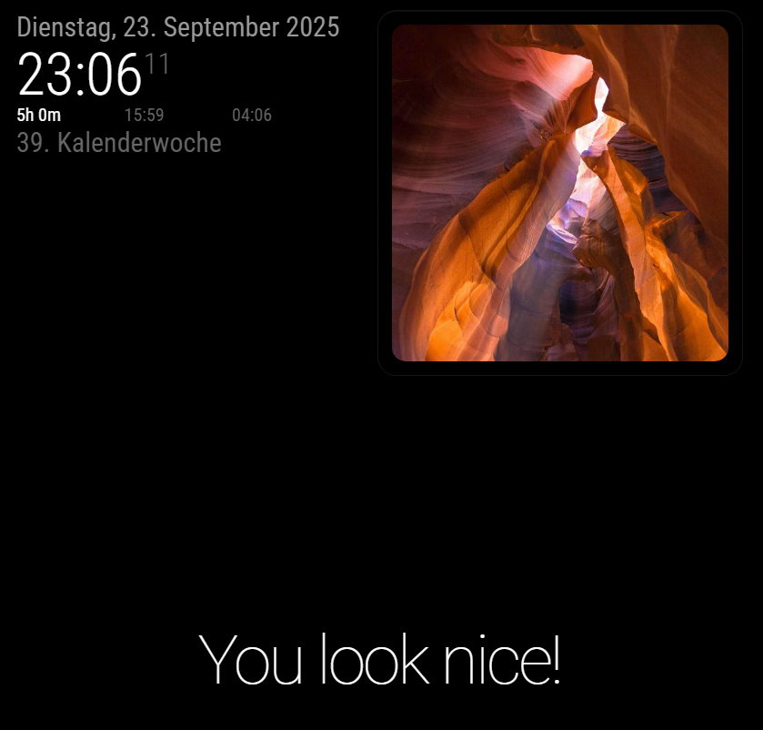
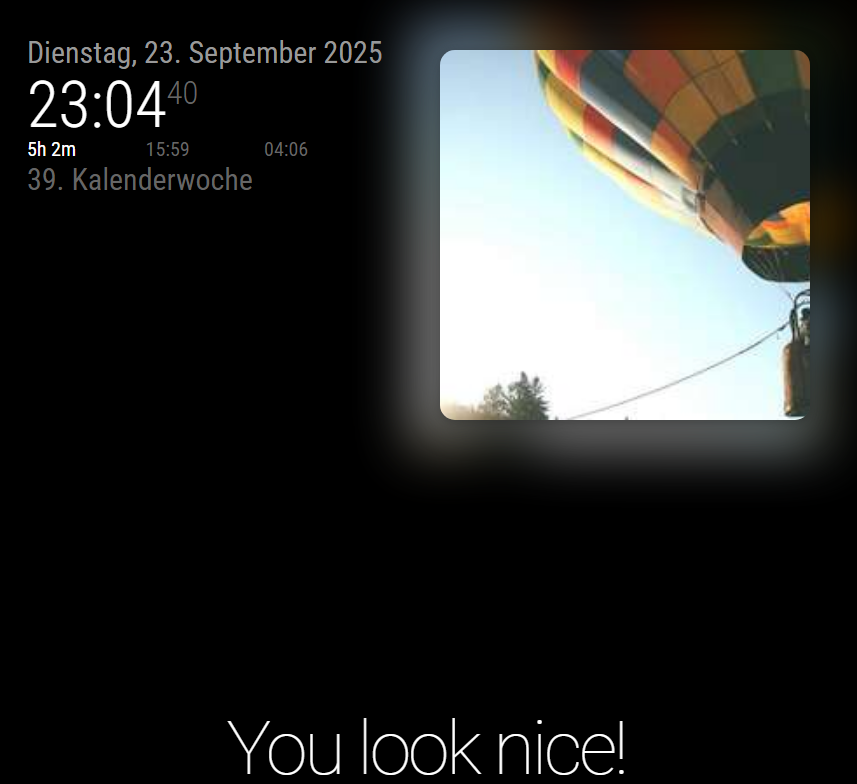

# MMM-Nextcloud

A MagicMirror² module for displaying random photos from your Nextcloud instance. This modernized version focuses exclusively on Nextcloud integration with enhanced features, improved error handling, and no jQuery dependency.

## Credits

This module is heavily inspired by [skuethe/MMM-RandomPhoto](https://github.com/skuethe/MMM-RandomPhoto). Thanks for your work :).  
Main differences: No support for local images or picsum.

## ✨ Features

- **🌤️ Nextcloud Integration**: Direct WebDAV connection to your Nextcloud photo collection.
- **📸 EXIF Data Support**: Displays date and location information from photo metadata. Optional reverse geocoding using [Openstreetmap Geocoder API](https://nominatim.openstreetmap.org/).
- **🔄 Auto-refresh**: Automatically refreshes photo list at configurable intervals
- **🎨 Modern UI**: Clean, responsive design with blur effects and smooth animations
- **📱 Status Icons**: Visual indicators for play/pause and navigation states
- **⚡ Performance**: Image caching and optimized loading

## 📸 Screenshots

See MMM-Nextcloud in action with different display configurations:

| Small Display (No Blur) | Small Display (With Blur) | Fullscreen with EXIF Data |
|:------------------------:|:--------------------------:|:--------------------------:|
|  |  |  |
| Compact mode without background blur | Compact mode with background blur effect | Full-size display showing EXIF metadata |

## 🚀 Installation

1. Navigate to your MagicMirror modules directory:
```bash
cd ~/MagicMirror/modules
```

2. Clone this repository:
```bash
git clone https://github.com/schlomm/MMM-Nextcloud.git
```

3. Install dependencies:
```bash
cd MMM-Nextcloud
npm install
```

## ⚙️ Configuration

Add the module to your `config/config.js` file:

```javascript
{
    module: "MMM-Nextcloud",
    position: "middle_center", // or any valid position
    config: {
        // Nextcloud connection settings
        repositoryConfig: {
            path: "https://your-nextcloud.com/remote.php/dav/files/username/Photos/",
            username: "your-username",
            password: "your-app-password", // Use app password for security
            recursive: true, // Search subdirectories
            exclude: ["\\.(tmp|temp)$", "Trash"] // Regex patterns to exclude files/folders
        },
        
        // Display settings
        showWidth: 800,
        showHeight: 600,
        opacity: 0.9,
        blur: true,
        backgroundOpacity: 0.8,
        grayscale: false,
        
        // Behavior settings
        updateInterval: 60, // Seconds between photo changes
        listRefreshInterval: 3600, // Seconds between photo list refreshes (1 hour)
        random: true,
        startPaused: false,
        startHidden: false,
        
        // EXIF and UI settings
        showExifData: true,
        enableGeocoding: true, // Enable reverse geocoding for GPS coordinates
        showOsmAttribution: false, // Show OpenStreetMap attribution when location data is displayed
        dateFormat: "DD MMMM YYYY", // Custom date format
        showStatusIcon: true,
        statusIconPosition: "top_right", // top_right, top_left, bottom_right, bottom_left
        statusIconMode: "show", // show, fade
        
        // Animation settings
        animationSpeed: 500
    }
}
```

### 🔐 Security Note
For security, use Nextcloud app passwords instead of your main password:
1. Go to Nextcloud Settings → Security
2. Create a new app password for MagicMirror
3. Use this app password in the configuration

## 📋 Configuration Options

| Option | Type | Default | Description |
|--------|------|---------|-------------|
| `repositoryConfig.path` | string | **Required** | Nextcloud WebDAV URL to your photos directory |
| `repositoryConfig.username` | string | **Required** | Nextcloud username |
| `repositoryConfig.password` | string | **Required** | Nextcloud password (preferably app password) |
| `repositoryConfig.recursive` | boolean | `false` | Search subdirectories recursively |
| `repositoryConfig.exclude` | array | `[]` | Array of regex patterns to exclude files/folders |
| `updateInterval` | number | `60` | Seconds between photo changes (minimum: 10) |
| `listRefreshInterval` | number | `3600` | Seconds between photo list refreshes (minimum: 300) |
| `showWidth` | number | `400` | Display width in pixels |
| `showHeight` | number | `400` | Display height in pixels |
| `opacity` | number | `0.3` | Main image opacity (0.0 - 1.0) |
| `backgroundOpacity` | number | `1.0` | Background blur image opacity (0.0 - 1.0) |
| `blur` | boolean | `false` | Enable background blur effect |
| `grayscale` | boolean | `false` | Display images in grayscale |
| `random` | boolean | `true` | Show images in random order |
| `startPaused` | boolean | `false` | Start with slideshow paused |
| `startHidden` | boolean | `false` | Start with module hidden |
| `showExifData` | boolean | `true` | Display EXIF data (date/location) |
| `enableGeocoding` | boolean | `true` | Enable reverse geocoding to convert GPS coordinates to location names |
| `showOsmAttribution` | boolean | `false` | Show OpenStreetMap attribution when location data is displayed |
| `dateFormat` | string | `"DD MMMM YYYY"` | Date format for EXIF display |
| `showStatusIcon` | boolean | `true` | Show status icon |
| `statusIconPosition` | string | `"top_right"` | Icon position: top_right, top_left, bottom_right, bottom_left |
| `statusIconMode` | string | `"show"` | Icon behavior: show, fade |
| `animationSpeed` | number | `500` | Animation duration in milliseconds |

## 🎮 Control Commands

Send notifications to control the module:

```javascript
// Next photo
this.sendNotification("NEXTCLOUD_NEXT");

// Previous photo (only works in non-random mode)
this.sendNotification("NEXTCLOUD_PREVIOUS");

// Toggle play/pause
this.sendNotification("NEXTCLOUD_TOGGLE");

// Pause slideshow
this.sendNotification("NEXTCLOUD_PAUSE");

// Resume slideshow
this.sendNotification("NEXTCLOUD_RESUME");

// Refresh photo list
this.sendNotification("NEXTCLOUD_REFRESH_LIST");
```

## 🏗️ Architecture
### File Structure

- `MMM-Nextcloud.js` - Main module file with modern JavaScript
- `node_helper.js` - Backend helper focusing on Nextcloud WebDAV
- `MMM-Nextcloud.css` - Clean, modern styling with clear class names
- `package.json` - Dependencies and module information


## 🐛 Troubleshooting

### Common Issues

1. **No images displayed**
   - Verify Nextcloud URL and credentials
   - Check that the path contains image files
   - Review browser console for errors
   - Check that the choosen folder does not contain to much photos. It is possible to create an album in the nextcloud Photos App and use this one in the configuration file to reduce the number of photos. This way there is no need create copys of pictures in another folder. The path variable in the configuration would be:
     path: "https://your-nextcloud.com/remote.php/dav/photos/username/albums/albumname/",

2. **Authentication failed**
   - Use app password instead of main password
   - Verify username and password are correct
   - Check Nextcloud server accessibility

3. **EXIF data not showing**
   - Some images may not contain EXIF data
   - Check browser console for parsing errors
   - Verify `showExifData` is set to `true`
   - For location data: ensure `enableGeocoding` is `true` and images contain GPS coordinates

4. **Geocoding issues**
   - Set `enableGeocoding: false` to disable reverse geocoding and improve performance
   - GPS coordinates will still be extracted but not converted to location names
   - Check network connectivity for OpenStreetMap Nominatim API access

### Debug Mode
Enable debug logging by setting log level in MagicMirror config:
```javascript
logLevel: ["INFO", "LOG", "WARN", "ERROR", "DEBUG"]
```

## 📄 License

MIT License - see LICENSE file for details.

## 🗺️ OpenStreetMap Attribution

This module uses geocoding services provided by [OpenStreetMap](https://www.openstreetmap.org) through the [Nominatim API](https://nominatim.openstreetmap.org/) to convert GPS coordinates from photo EXIF data into human-readable location names.

**Data Attribution**: Location data © [OpenStreetMap](https://www.openstreetmap.org/copyright) contributors, available under the [Open Database License](https://opendatacommons.org/licenses/odbl/).

When the `enableGeocoding` option is enabled, this module makes requests to the Nominatim API service operated by the OpenStreetMap Foundation. Please refer to the [Nominatim Usage Policy](https://operations.osmfoundation.org/policies/nominatim/) for service terms and fair use guidelines.

## ❓ Support & Feature Requests

If you have questions, encounter issues, or would like to request new features, please create a GitHub issue:

🐛 **Bug Reports**: [Create an Issue](https://github.com/schlomm/MMM-Nextcloud/issues/new?template=bug_report.md)
- Include your MagicMirror version
- Provide your module configuration (remove sensitive data)
- Share relevant log output from browser console

💡 **Feature Requests**: [Create an Issue](https://github.com/schlomm/MMM-Nextcloud/issues/new?template=feature_request.md)
- Describe the feature and its use case
- Explain how it would improve the module
- Consider compatibility with existing functionality

❓ **Questions**: [Browse Existing Issues](https://github.com/schlomm/MMM-Nextcloud/issues) or create a new one
- Check if your question has already been answered
- Provide context about your setup and what you're trying to achieve

## 🤝 Contributing

1. Fork the repository
2. Create a feature branch
3. Make your changes with proper testing
4. Submit a pull request

## 📋 Changelog

### Version 1.0.0 (Current)
- Complete rewrite; removed all unused dependencies.
- Removed jQuery dependency
- Added automatic photo list refresh
- Enhanced error handling and logging
- Improved EXIF data extraction
- Modern CSS with semantic class names
- Added image caching
- Removed unused providers (picsum, localdirectory)
- Added configurable date formatting

## 🙏 Acknowledgments

- Original MMM-RandomPhoto by Diego Vieira and skuethe
- MagicMirror² community for the excellent framework
- Nextcloud team for the robust WebDAV implementation
